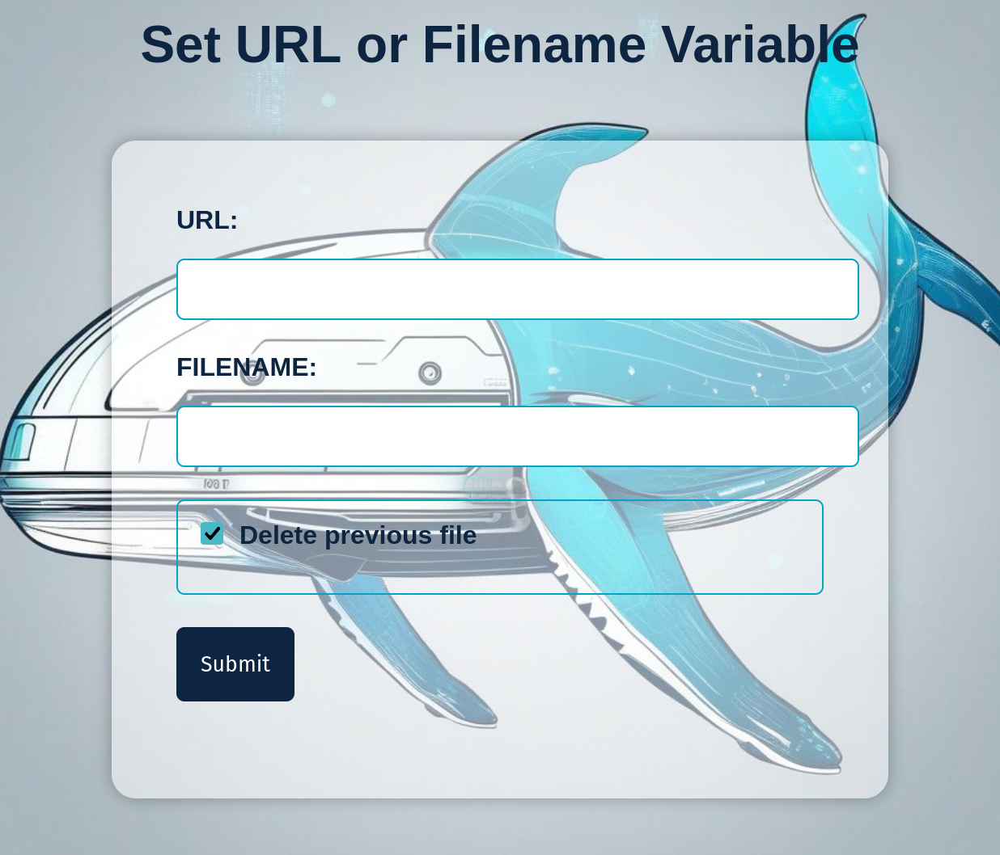

# GOLAE

Get user agent and IP from a visitor to your redirection website

## Use
* To assign a new URL (change the localhost IP by the IP you wish):

```
http://127.0.0.1/
http://127.0.0.1/assign

```


* Fill in with the URL to redirect and the file name where you want to save the backup of user agents from the victim.


* The url to redirect
```
http://127.0.0.1/

```
* See the log of the users connected

```
http://127.0.0.1/doc

```


## Steps

1. Download this repository:

```commandline
git clone https://github.com/drkrysSrng/golae.git
```
3. Launch docker-compose.yml file to create container and lanunch the server:

```commandline
cd dev/
docker compose up -d
```

## Creating the image manually

1. Create the docker image using docker build:

```commandline
docker build --tag golae:1.0 .
```

## Save docker image to take it to destination server:
* Saving the docker image to a tar.gz:
```commandline
docker save golae:1.0 | gzip > golae_1.0.tar.gz

docker save golae:latest | gzip > golae_latest.tar.gz
```
2. Load in the destination server:

```commandline
docker load < golae_1.0.tar.gz

```

3. Launch the docker-compose directly but, comment the build part from the destination server:

```commandline
docker-compose up -d
```

## Docker-compose

* The **PUBLIC_IP** must your public IP or your server's to check you are outside or NOT.

```yml
version: '3.3'
services:
  web:
    build: # This part only if you don't want to build the image by yourself
      context: .
      dockerfile: Dockerfile
    image: golae
    container_name: golae
    restart: always
    #depends_on:
    #  - other
    ports:
      - 80:7777

```

## Other Docker Commands

* Stop the container from the docker-compose.yml file
```commandline
docker compose down
```
* Stop and remove the container manually:

```commandline
docker stop golae
docker rm golae
```
* Remove the image
```
docker rmi golae:latest
```

* Remove all the broken images
```
docker image prune
```
* See the log of the container
```
docker logs -f golae
```

* Exer a command inside the container or enter to it

```
docker exec -it golae bash
docker exec -it golae command
```


